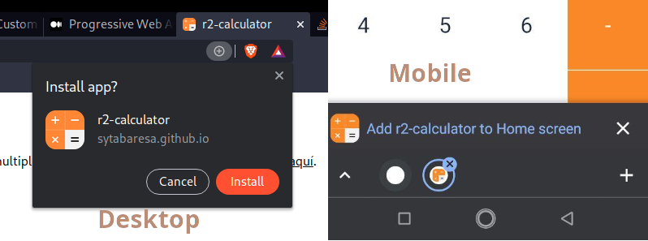
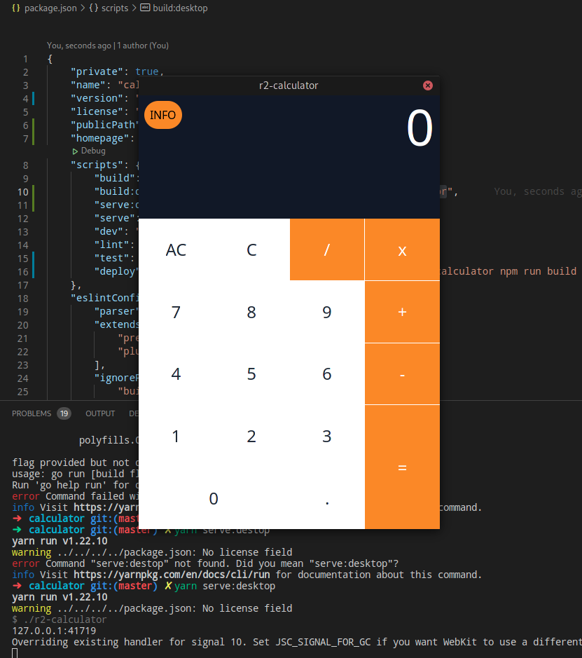

# r2-calculator

simple calculator in React (Preact) with web, responsive, PWA and desktop version: see demo [here](https://sytabaresa.github.io/r2-calculator/)

## techs used:
- [Tailwindcss](https://tailwindcss.com/)
- [Preact](https://preactjs.com/)
- [Robot](https://thisrobot.life/)
- [WebView](https://github.com/WebView/webview)
- [GitHub Pages](https://pages.github.com/)

## PWA

you can install as a PWA application in a desktop browser (firefox, chrome, etc) or in a Android/iOS browser, clicking in the corresponding popup and installing the program:

## Destop application:

you can compile go code (Windows, Linux, OSX) to make a desktop version of the app:

## CLI Commands
*   `npm install`: Installs dependencies

*   `npm run dev`: Run a development, HMR server

*   `npm run serve`: Run a production-like server

*   `npm run build`: Production-ready build

+   `npm run deploy`: Production-ready build and upload to GitHub Pages

+   `npm run desktop`: Production-ready Desktop application

<!-- *   `npm run lint`: Pass TypeScript files using ESLint -->

<!-- *   `npm run test`: Run Jest and Enzyme with
    [`enzyme-adapter-preact-pure`](https://github.com/preactjs/enzyme-adapter-preact-pure) for
    your tests -->

<!-- For detailed explanation on how things work, checkout the [CLI Readme](https://github.com/developit/preact-cli/blob/master/README.md). -->
