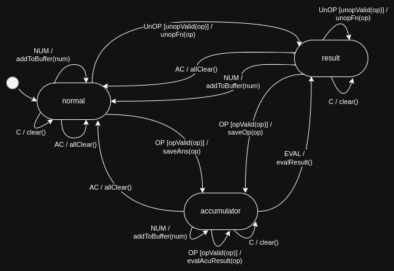

# r2-calculator

*see the challenge [here](./challenge.md)*

simple calculator in React (Preact) with web, responsive, PWA and desktop version: see demo [here](https://sytabaresa.github.io/r2-calculator/)

## techs used:
- [Tailwindcss](https://tailwindcss.com/)
- [Preact](https://preactjs.com/)
- [Robot](https://thisrobot.life/)
- [WebView](https://github.com/WebView/webview)
- [GitHub Pages](https://pages.github.com/)

## PWA

you can install as a PWA application in a desktop browser (firefox, chrome, etc) or in a Android/iOS browser, clicking in the corresponding popup and installing the program:

## Destop application:

you can compile go code (Windows, Linux, OSX) to make a desktop version of the app:

## CLI Commands
*   `npm install`: Installs dependencies

*   `npm run dev`: Run a development, HMR server

*   `npm run serve`: Run a production-like server

*   `npm run build`: Production-ready build

+   `npm run deploy`: Production-ready build and upload to GitHub Pages

+   `npm run desktop`: Production-ready Desktop application

## Explanation
The calculator's logic is implemented as a finite state machine (FSM) using the [Robot3](https://thisrobot.life/) library, as defined in [`machine.ts`](./src/components/calculator/machine.ts). The FSM manages the calculator's state transitions and operations, ensuring predictable and robust behavior.

For a visual overview, see the diagram below:

### States

- **normal**: The default state where the user is entering numbers.
- **accumulator**: The state after a binary operator (like `+`, `-`, `*`, `/`) is pressed, waiting for the next number input.
- **result**: The state after an evaluation (e.g., pressing `=`), binary operation, or unary operation (like squaring).

### Events

- **NUM**: Number button pressed. Appends the digit to the current buffer.
- **OP**: Operator button pressed. Stores the current value and operator, and transitions to `accumulator`.
- **UnOP**: Unary operator (e.g., `x²`) pressed. Applies the operation immediately and transitions to `result`.
- **EVAL**: Equals (`=`) pressed. Evaluates the current operation and transitions to `result`.
- **AC**: All Clear. Resets the calculator to its initial state.
- **C**: Clear. Clears the current input buffer.

### Transitions

- From `normal`:
  - `NUM` → stays in `normal`, appends digit.
  - `OP` → goes to `accumulator`, stores operator and value.
  - `UnOP` → goes to `result`, applies unary operation.
  - `AC`/`C` → clears state or buffer.

- From `accumulator`:
  - `NUM` → stays in `accumulator`, appends digit.
  - `OP` → stays in `accumulator`, evaluates previous operation and chains the next.
  - `EVAL` → goes to `result`, evaluates the operation.
  - `AC`/`C` → clears state or buffer.

- From `result`:
  - `NUM` → goes to `normal`, starts new input.
  - `OP` → goes to `accumulator`, starts new operation with result as the first operand.
  - `UnOP` → stays in `result`, applies unary operation to result.
  - `AC`/`C` → clears state or buffer.

### Operations

- **Binary operations** (`+`, `-`, `*`, `/`) are handled by storing the current value and operator, then evaluating when the next number or `=` is pressed.
- **Unary operations** (currently only `x²`) are applied immediately to the current buffer or result.
- The buffer is limited to 10 characters to prevent overflow.

This FSM approach ensures that the calculator behaves consistently, handles edge cases (like chaining operations or pressing clear), and is easy to extend with new operations or states in the future.
